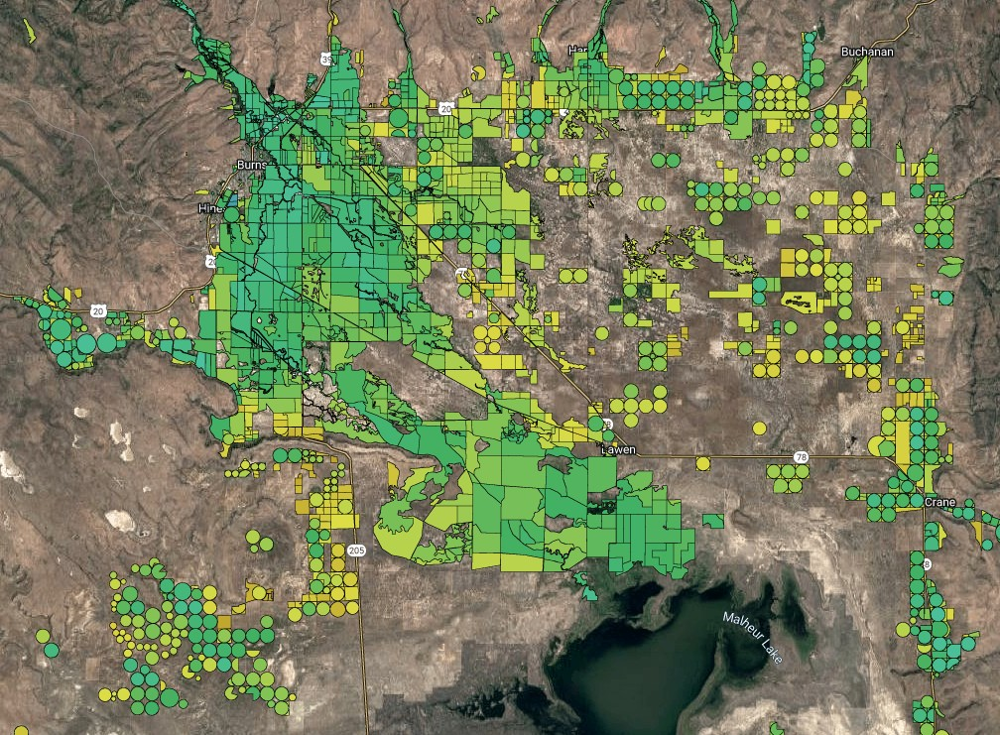
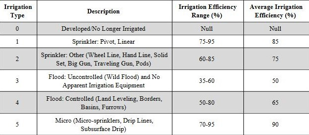
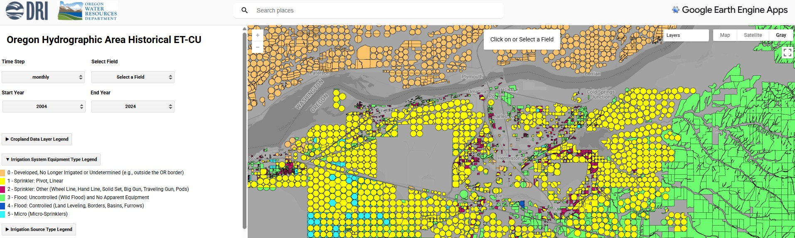

dri-owrd-et
=========================

# [Oregon Statewide ET Project](https://www.dri.edu/project/owrd-et/)

Huntington, J., Minor, B., Bromley, M., Pearson, C., Beamer, J., Ingwersen, K., Carrara, K., Atkin, J.,
Brito, J., Morton, C., Dunkerly, C., Volk, J., Ott, T., ReVelle, P., Fellows, A., and Hoskinson, M.
(2025). Crop evapotranspiration, consumptive use, and open water evaporation for Oregon. Division
of Hydrologic Sciences, Desert Research Institute report 41306, 94 p., 10 appendices. [https://s3-us-west-2.amazonaws.com/webfiles.dri.edu/Labs/Huntington/owrd/Huntington_et_al_2025_DRI_Report_41306.pdf](https://s3-us-west-2.amazonaws.com/webfiles.dri.edu/Labs/Huntington/owrd/Huntington_et_al_2025_DRI_Report_41306.pdf)

--------

## **Overview**
The repository was created for the **Oregon Statewide ET Project** with the following two primary objectives in mind: 
- Provide a chained-modeling workflow that integrates the OpenET and ET Demands models to reproduce Oregon-specific historical evapotranspiration (ET) and consumptive use of irrigation (CUirr) geopackages that contain field- or HUC-level timeseries data for the 1985-2022 time period.  
- Leverage the same workflow (excluding pre-processing) to incorporate additional years of data (i.e., 2023 and beyond) into the geopackages.

--------

## **Notebooks**
The repository includes a collection of Jupyter Notebooks (located in the "notebooks" sub-folder), with each notebook corresponding to a specific component of the overall workflow:
1. **pre_processing.ipynb** - Pre-processing and attribution of field boundaries
2. **ee_zonal_stats.ipynb** - ET spatial reductions using the Google Earth Engine ([GEE](https://earthengine.google.com/)) Python Application Programming Interface ([API](https://developers.google.com/earth-engine/tutorials/community/intro-to-python-api))
3. **post_processing.ipynb** - Post-processing of data, spatial joins of model outputs, spatial aggregations, and geopackage development

--------

## **Workflow Diagram**
The components of the notebooks above generally follow the workflow diagram below (excepting geopackage development):

Workflow Diagram steps from page 27 of the report:

1. Attribute fields with respective acreage, HUC-8, and HUC-12 values.
2. Attribute fields with their annual crop type, irrigation efficiency, irrigation water
source, and irrigation system type.
3. Attribute fields with their annual irrigation status classifications.
4. Compute monthly ETa, EToF, ETo, and total gridMET precipitation rates for all
fields (1985 through 2022) using a pixel area-weighted spatial mean reducer in
GEE.
5. Pair field summaries with the respective monthly ETc, Prz, and NIWR estimates
from ET Demands using respective grid cell and crop type information.
6. Interpolate monthly EToF linearly for each field, then multiply the interpolated
EToF by the monthly ETo to fill non-consecutive months with missing ETa
estimates.
7. Fill remaining months (i.e., consecutive months) of missing ETa estimates using the
respective monthly EToF climatologies (representing fixed windows or blocks of
average EToF for 1985 through 1991, 1992 through 1997, 1998 through 2003, 2004
through 2009, 2010 through 2015, and 2016 through 2022) and multiply the gapfilled EToF by the monthly ETo to estimate monthly ETa for the remaining missing
months.
8. Multiply spatial average monthly ETa, ETo, ETc, total precipitation, Prz, and NIWR
rates by the field acreage to derive monthly volumes for ETa, ETo, ETc, total
precipitation, Prz, and NIWR, respectively.
9. Subtract monthly Prz volumes from monthly ETa volumes to compute monthly CUirr
volumes, then divide monthly CUirr volumes by the respective irrigation efficiency
values to compute AW volumes.
10. Adjust field-level monthly Prz, CUirr, and AW volumes when ETa is less than the Prz
by carrying forward the remaining soil moisture (i.e. Prz surplus) into the following
month’s CUirr and AW volumes.
11. Sum all monthly volumes of ETa, ETo, ETc, total precipitation, Prz, NIWR, CUirr,
and AW to obtain annual totals for each field.
12. Filter out non-irrigated fields each year based on annual irrigation status
13. Sum all annual volumes of ETa, ETo, ETc, total precipitation, Prz, NIWR, CUirr, and
AW from irrigated fields within each HUC-8 and HUC-12 by water source type.

--------

## **Notebook Details**

### 1. Pre-processing and attribution

Exports tables of static and dynamic (annual) attributes for field boundaries either to Google Drive (for GEE-based tasks) or to local storage. **NOTE**: crop type and gridmet cell ID attributes for field boundaries are a required input for ET Demands modeling.

- INPUTS  
Field boundary shapefile (e.g., "Oregon_Hyd_Area_Ag_Boundaries_20241016.shp" located in the "shapefiles" sub-folder) along with a corresponding Google Earth Engine Feature Collection, both containing the unique identification attribute "**OPENET_ID**". 

- OUTPUTS  
CSV files with static and dynamic (annual) attributes for each field, uniquely identified by the "**OPENET_ID**" attribute.  
  
    - Static attribute summaries:

        - Irrigation water source type ("**srctype**") - an integer value (0-3 range) indicating the irrigation water source type supplying the field.

            | Type | Value |
            | :---: | :---: |
            | no water source | 0 |
            | groundwater | 1 |
            | surface water | 2 |
            | mixed | 3 |
             
        - Irrigation system type ("**ITYPE**") - an integer value (0-5 range) indicating the generalized category of irrigation system equipment used for the field, as defined in the table below (table 1 of the report). 
 
        - Irrigation efficiency ("**IRR_EFF**") - a floating point value (0-0.9 range) indicating the average irrigation system efficiency for the field, which is based on the irrigation system equipment and the associated ranges of irrigation efficiencies defined in the table below (table 1 of the report). A value of 0 indicates that no irrigation system type and efficiency could be determined for the field or was outside of the scope for this project (e.g., fields outside the Oregon state border).
            

 
          
        - GridMET cell code ("**GRIDMET_ID**") - an integer value indicating the unique identification code for the gridMET cell containing the field geometry.  

        - Hydrologic Unit code ("**HUC8**" or "**HUC12**") - a string value indicating the 8- or 12-digit identification code for the watershed containing the field geometry.  
 
        - Hydrologic Unit name ("**HUC8_name**" or "**HUC12_name**") - a string value indicating the identification name for the watershed containing the field geometry.  
 
        - Military Grid Reference System tile ("**MGRS_TILE**") - a string value (e.g., "10TNM") indicating the MGRS tile containing the field geometry. "10T" is the grid zone designation and the "NM" is the 100,000 meter unique square ID.  
 
        - Oregon Water Resources Department basin ("**OWRD**") - an integer value (0-18 range) indicating the OWRD administrative basin containing the field geometry. A value of 0 indicates the field geometry is outside of the Oregon state border.  
 
        - Cuenca (1992) region ("**Region**") - an integer value (0-27 range) indicating the agricultural region containing the field geometry, as defined in figure 1 (page 6) of [Cuenca (1992)](https://extension.oregonstate.edu/sites/extd8/files/documents/em8530.pdf). A value of 0 indicates the field geometry is outside of the Oregon state border.  
    
    - Dynamic (annual) attribute information:

        - Cropland Data Layer code ("**CROP_[YEAR]**") - an integer value indicating the GEE-computed mode of the Cropland Data Layer ([CDL](https://www.nass.usda.gov/Research_and_Science/Cropland/SARS1a.php)) codes for pixels within the field geometry. **Note**: CDL codes for the region are available starting in 2007. For years prior to 2007, the majority of the field's CDL codes from 2007-2021 were applied to represent these earlier, pre-CDL years.  

        - IrrMapper irrigated acreage ("**ACRES_IRRIGATED**") - represents the total acreage of pixels within the field geometry classified as irrigated by [IrrMapper](https://doi.org/10.3390/rs12142328). This value is used to determine the field's annual irrigation status, where a field is considered irrigated if more than 40% of its acreage is classified as irrigated.  
 
        - IrrMapper wetland acreage ("**ACRES_WETLAND**") - represents the total acreage of pixels within the field geometry classified as wetland by IrrMapper. This classification is used alongside EToF classes (described below) and irrigation source types to determine the annual irrigation status of fields not identified as irrigated by the IrrMapper irrigated classification.  
 
        - Fraction of reference ET classification ("**ETOF_IRR_STATUS_[YEAR]_MODE**") - an integer value (1-5 range) representing the mode of the fraction of reference ET (EToF) irrigation status classification. This classification is used alongside IrrMapper wetland classes and irrigation water source types to determine the annual irrigation status of fields not identified as irrigated by the IrrMapper irrigated classification. **Note**: no fields are assigned to the wet soil class "4" because this class pertains to a different irrigation status mapping method (i.e., Harmonized Landsat-Sentinel method used in the [Historical ET and Consumptive Use of Irrigated Areas of the Upper Colorado River Basin](http://dx.doi.org/10.13140/RG.2.2.31069.63206)). Fields classified as "5" (unclassified) typically occur when a geometry is too small to intersect a pixel centroid--Common examples include household lawns or small patches of pasture, developed, or other cultivated areas.
 
            | Classification | Value | Comments |
            | :---: | :---: | :---: |
            | not irrigated | 1 | N/A |
            | irrigated | 2 | N/A |
            | shorted | 3 | still considered irrigated |
            | wet soil | 4 | not produced by EToF method |
            | unclassified | 5 | assumed irrigated |

### 2. ET spatial reductions

Exports field-level irrigation water use timeseries summaries and HUC-level small pond evaporation timeseries summaries to Google Drive (recommended) or Google Cloud Storage. **NOTE**: Field-level exports are year-specific (based on a shifted water-year from November to October) and are output separately as composite dataframes, similar in structure to an ArcGIS attribute. HUC-level exports are similar, however, they include data for the entire period of record (1985-2024).

- INPUTS  
Google Earth Engine Feature Collection equivalent to the field boundary shapefile ("Oregon_Hyd_Area_Ag_Boundaries_20241016.shp" located in the "shapefiles" sub-folder) containing the unique identification attribute "**OPENET_ID**" for field-level summaries and the gridMET agricultural cell shapefile ("or_gridmet_et_cells.shp" located in the "shapefiles" sub-folder) for HUC-level summaries, which is used to mask gridMET pixels to agricultural pixels within each HUC8/HUC12 only. 

- OUTPUTS  
CSV files with ET spatial summaries for each field or HUC, uniquely identified by the "**OPENET_ID**" attribute for field-level summaries and a "**HUC8_code**" or "**HUC12_code**" attribute for HUC-level summaries.  
        
    - Monthly (ETa, ETo, EToF, PPT) and monthly climatology (EToF) field-level irrigation/water use summaries for ~250,000 features:
 
        - filename example "or_field_summaries_water_year_shift_1mo_1985_et.csv"
     
            - actual ET ("**ETa_[MONTH]_[YEAR]**") - OpenET Ensemble actual ET rate in millimeters.  
         
        - filename example "or_field_summaries_water_year_shift_1mo_1985_et_reference.csv"

            - bias-corrected reference ET ("**ET_Reference_[MONTH]_[YEAR]**") - bias-corrected gridMET grass reference ET in millimeters.  

        - filename example "or_field_summaries_water_year_shift_1mo_1985_et_fraction.csv"

            - fraction of reference ET ("**ET_Fraction_[MONTH]_[YEAR]**") - fraction of OpenET actual ET and the bias-corrected gridMET grass reference ET.  

        - filename example "or_field_summaries_water_year_shift_1mo_1984_1991_et_fraction_climo.csv"

            - fraction of reference ET climatology ("**ET_Fraction_[MONTH]**") - fraction of OpenET actual ET and the bias-corrected gridMET grass reference ET climatology for the given window (e.g., 1984-1991).  

        - filename example "or_field_summaries_water_year_shift_1mo_1985_ppt.csv"

            - precipitation ("**PPT_[MONTH]_[YEAR]**") - gridMET total precipitation.  
        
    - Monthly and monthly climatology HUC-level small pond evaporation summaries:
 
        - filename example "or_gridmet_huc8_summaries_monthly_eto_small_pond_evap_inches.csv"
     
            - non bias-corrected reference ET ("**[YEAR][MONTH]_EToN**") - HUC8 or HUC12 average gridMET grass reference ET (ETo).  

            - bias-corrected reference ET ("**[YEAR][MONTH]_EToB**") - HUC8 or HUC12 average gridMET grass reference ET (ETo), bias-corrected with weather station data.  

            - non bias-corrected ETo-based evaporation ("**[YEAR][MONTH]_EvpB**") - HUC8 or HUC12 average evaporation calculated as 1.05 times the non bias-corrected ETo.  
     
            - bias-corrected ETo-based evaporation ("**[YEAR][MONTH]_EvpN**") - HUC8 or HUC12 average evaporation calculated as 1.05 times the bias-corrected ETo.  
         
        - filename example "or_gridmet_huc8_summaries_monthly_climo_eto_small_pond_evap_inches.csv"
     
            - non bias-corrected reference ET climatology ("**[MONTH]_EToN**") - HUC8 or HUC12 average gridMET grass reference ET (ETo) climatology.  

            - bias-corrected reference ET climatology ("**[MONTH]_EToB**") - HUC8 or HUC12 average gridMET grass reference ET (ETo) climatology, bias-corrected with weather station data.  

            - non bias-corrected ETo-based evaporation climatology ("**[MONTH]_EvpB**") - HUC8 or HUC12 average evaporation climatology, calculated as 1.05 times the non bias-corrected ETo.  
     
            - bias-corrected ETo-based evaporation climatology ("**[MONTH]_EvpN**") - HUC8 or HUC12 average evaporation climatology, calculated as 1.05 times the bias-corrected ETo.

### 3. Post-processing
Post-processes all individual static, annual, and monthly table/summary exports from steps 1 & 2 above into single tables per year, joins monthly ET Demands output to field summaries, gap-fills missing ET data using climatologies and linear interpolation, calculates volumes and performs soil moisture carry forward and applied water calculations, aggregates field-level data into HUC-level summaries with irrigation status filtering and partitioning of totals for different irrigation source water types (i.e., groundwater and surface water), and builds geopackages summarizing the full timeseries.

- INPUTS  
Individual field-level irrigation/water use tables (per year) and HUC-level small pond evaporation tables exported during steps 1 & 2 above, ET Demands monthly timeseries (e.g., ETc, Prz, NIWR), and the ET Demands CDL crosswalk table ("OR_unique_cdl_etdemands_crosswalk_model_setup.csv"). 

- OUTPUTS  
CSV files with ET spatial summaries for each field or HUC, uniquely identified by the "**OPENET_ID**" attribute for field-level summaries and a "**HUC8_code**" or "**HUC12_code**" attribute for HUC-level summaries, and geopackages containing timeseries data and geometries.  

    1. Concatenate individual static & annual irrigation/water use summaries (creates one table per year)
        - output filename example "or_field_summaries_water_year_shift_1mo_1985_pre_et_demands.csv"
    2. Join ET Demands data to field summaries
        - output filename example "or_openet_etdemands_monthly_water_year_shift_1mo_1985_pre_gapfill.csv"
    3. Gap-fill EToF using linear interpolation (1 mo) or climatologies (2+ mo)
        - output filename example "or_openet_etdemands_monthly_water_year_shift_1mo_1985_gap_filled.csv" 
            - **NOTE**: This step requires all individual annual tables within the respective gap-filling window to be processed in the previous step (i.e., ET Demands join)
            - Start/End year options for each gap-filling window:
                > 1985-1991 
                > 1992-1997 
                > 1998-2003 
                > 2004-2009 
                > 2010-2015 
                > 2016-2022 (note: if processing 2023 and 2024 extend the end year from 2022)
    4. Soil moisture carry forward and applied water calculations
        - output filename example "or_openet_etdemands_monthly_water_year_shift_1mo_1985_final.csv"
            - Final field-level stats tables/CSVs will be produced during this step
            - **NOTE**: This step requires all individual gap-filled annual tables (1985-2022; 2023 & 2024 if updating the database within more recent data) from step 3 above to be prepared so that carry forward calculations are consistent throughout the study period
    5. HUC8/HUC12 aggregations of irrigation/water use summaries
        - output filename example "or_huc8_openet_etdemands_water_year_shift_1mo_srctype_all.csv"
    6. HUC-level irrigation/water use shapefile preparation
        - output filename example "or_openet_huc8_irrigated_all.shp"
    7. Field-level geopackage preparation
        - output filename "or_field_geopackage.gpkg"
    8. HUC-level geopackage preparation
        - output filename "or_huc_geopackage.gpkg"
            - includes irrigation/water use and small pond evaporation summaries
    9. Visualization tools 
        a. HUC8 CUirr/acreage histograms for 2017 & 2021  
            

 
        b. HUC8 ETa/ETc and CUirr/NIWR box & whisker plots  
            

 
        c. HUC8 CUirr/Applied Water heatmaps & timeseries plots  
            

 
        d. Cuenca & ET Demands ETc/NIWR bar chart intercomparison  
            

 
        e. Eddy covariance & OpenET Ensemble ETa scatterplot intercomparison  
            

 
        f. Monthly cumulative ETa, Prz, and CUirr volume timeseries & distribution plots  
            

 
    10. Database reformatting for field-level GEE App [tool](https://dri-apps.projects.earthengine.app/view/owrd-oregon-etcu-field-summaries)  
        

 

--------

