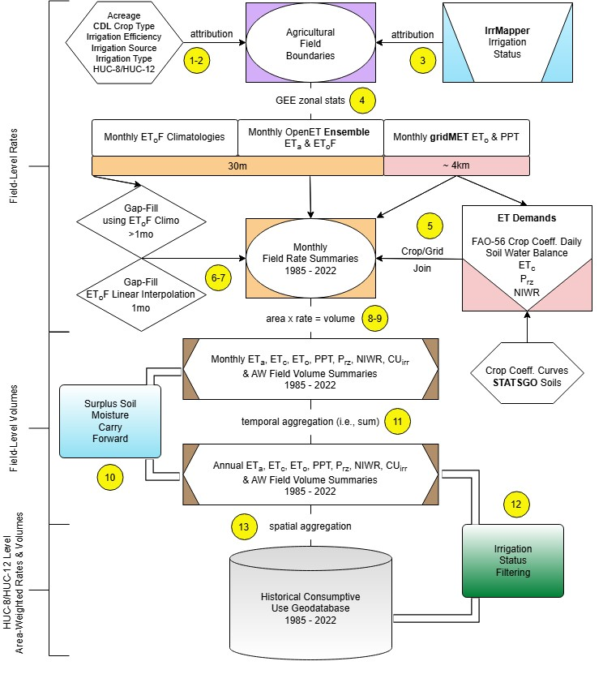

dri-owrd-et
=========================

# [Oregon Statewide ET Project](https://www.dri.edu/project/owrd-et/)

This repository was created with the following two goals in mind related to the **Oregon Statewide ET Project**, a coordinated effort between the Desert Research Institute ([DRI](https://www.dri.edu/)), Oregon Water Resources Department ([OWRD](https://www.oregon.gov/owrd/pages/index.aspx)), [OpenET](https://etdata.org/), and Oregon State University ([OSU](https://oregonstate.edu/)):
1. Provide a chained-modeling workflow to reproduce historical evapotranspiration and consumptive use of irrigation geopackages that contains field- or HUC-level timeseries data for the 1985-2022 time period.
2. Leverage the same workflow to add additional years (i.e., 2023 and forward) of data to the geopackages.

The repository is structured with a series of Jupyter Notebooks (found in the "notebooks" sub-folder), one for each of the following components of the overall workflow:
1. **pre_processing.ipynb** - Field boundary pre-processing and attribution
2. **ee_zonal_stats.ipynb** - ET spatial reductions using the Google Earth Engine ([GEE](https://earthengine.google.com/)) Python Application Programming Interface ([API](https://developers.google.com/earth-engine/tutorials/community/intro-to-python-api))
3. **post_processing.ipynb** - Post-processing, spatial joins of model outputs, spatial aggregations, and geopackage development

The components above generally follow the workflow diagram below:

Workflow Diagram steps from page 27 of the [report](https://s3-us-west-2.amazonaws.com/webfiles.dri.edu/Labs/Huntington/owrd/Huntington_et_al_2025_DRI_Report_41306.pdf)

1) Attribute fields with respective acreage, HUC-8, and HUC-12 values
2) Attribute fields with their annual crop type, irrigation efficiency, irrigation water
source, and irrigation system type
3) Attribute fields with their annual irrigation status
4) Compute monthly ETa, EToF, ETo, and total gridMET precipitation rates for all
fields (1985 through 2022) using a pixel area-weighted spatial mean reducer in
GEE
5) Pair field summaries with the respective monthly ETc, Prz, and NIWR estimates
from ET Demands using respective grid cell and crop type information
6) Interpolate monthly EToF linearly for each field, then multiply the interpolated
EToF by the monthly ETo to fill non-consecutive months with missing ETa
estimates
7) Fill remaining months (i.e., consecutive months) of missing ETa estimates using the
respective monthly EToF climatologies (representing fixed windows or blocks of
average EToF for 1985 through 1991, 1992 through 1997, 1998 through 2003, 2004
through 2009, 2010 through 2015, and 2016 through 2022) and multiply the gapfilled EToF by the monthly ETo to estimate monthly ETa for the remaining missing
months
8) Multiply spatial average monthly ETa, ETo, ETc, total precipitation, Prz, and NIWR
rates by the field acreage to derive monthly volumes for ETa, ETo, ETc, total
precipitation, Prz, and NIWR, respectively
9) Subtract monthly Prz volumes from monthly ETa volumes to compute monthly CUirr
volumes, then divide monthly CUirr volumes by the respective irrigation efficiency
values to compute AW volumes
10) Adjust field-level monthly Prz, CUirr, and AW volumes when ETa is less than the Prz
by carrying forward the remaining soil moisture (i.e. Prz surplus) into the following
month’s CUirr and AW volumes
11) Sum all monthly volumes of ETa, ETo, ETc, total precipitation, Prz, NIWR, CUirr,
and AW to obtain annual totals for each field
12) Filter out non-irrigated fields each year based on annual irrigation status
13) Sum all annual volumes of ETa, ETo, ETc, total precipitation, Prz, NIWR, CUirr, and
AW from irrigated fields within each HUC-8 and HUC-12 by water source type.

--------

## **Workflow Details**

### 1. Field boundary pre-processing and attribution:
Prepare a field boundary shapefile with static and dynamic (annual) attributes
> Static attributes include irrigation source type, irrigation system type, irrigation efficiency, HUC8/HUC12, OWRD admin basin, county codes, and Cuenca (1992) region assignments
> Dynamic (annual) attributes include irrigation status and CDL crop type codes  
   
### 2. GEE ET spatial reductions workflow overview:
Export irrigation/water use field-level summaries and small pond evaporation HUC-level summaries to Google Drive (recommended) or Google Cloud Storage
> Field-level exports are year-specific (shifted water-year months, Nov-Oct) and export separately as composite dataframes (similar to an ArcGIS attribute table for a shapefile)  
> Field-level irrigation/water use summaries: monthly (e.g, ETa, ETo, EToF) and monthly climatology (EToF only) summaries for ~250,000 features  
> HUC-level small pond evaporation summaries: monthly and monthly climatology (ETo and Evaporation) summaries for HUC8 and HUC12 features

### 3. Post-processing workflow overview:
NOTE: before proceeding with post-processing steps, please unzip the field boundary shapefile (Oregon_Hyd_Area_Ag_Boundaries_20241016.7z) located within the "shapefiles" sub-folder so that the shapefile can be read in with Python for post-processing
1. Concatenate individual static & annual irrigation/water use summaries (creates one table per year)
2. Join ET Demands data to field summaries
3. Gap-fill EToF using linear interpolation (1 mo) or climatologies (2+ mo)
   * **NOTE**: This step requires all individual annual tables within the respective gap-filling window to be processed in the previous step (i.e., ET Demands join)
   * Start/End year options for each gap-filling window:
    > 1985-1991 
    > 1992-1997 
    > 1998-2003 
    > 2004-2009 
    > 2010-2015 
    > 2016-2022
4. Soil moisture carry forward and applied water calculations
   * Final field-level stats tables/CSVs will be produced during this step
5. HUC8/HUC12 aggregations of irrigation/water use summaries
6. HUC-level irrigation/water use shapefile preparation
7. Field-level geopackage preparation
8. HUC-level geopackage preparation
    * includes irrigation/water use and small pond evaporation summaries
 

--------

